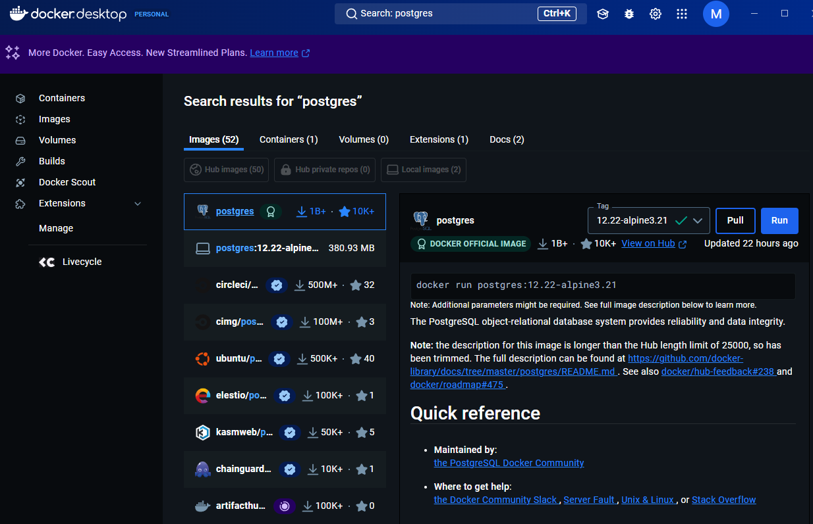

# DOCUS

- initialization of the overall application, simple installation and setup for frontend components
- setup ORM and Supabase
  - install prisma (`npm install @prisma/client`)
  - setup prisma (env setup)
  - run migrations (`npx prisma db push`)
  - run dev migration (`npx prisma migrate dev`)
  - see prisma db (`npx prisma studio`)
- auth setup (todo)

## Stack

- NextJs
- Prisma
- Supabase / Local (Postgress) / Docker (Postgress)

## Setup

- pnpm i
- pnpm prisma generate
- pnpm add prisma @prisma/client
- pnpm update prisma @prisma/client

## TODO

### Feature Checklist for Development

1. **Centralized Digital Repository**
   - [x] Design and implement a database schema to securely store civil registry documents (e.g., birth, death, and marriage certificates).
   - [x] Develop search functionality with advanced filtering options (e.g., document type, date, or request status) for efficient document retrieval.
   - [ ] Add support for multiple document formats, including PDF, images, and scanned files.

2. **Automated Document Classification**
   - [ ] Implement logic for categorizing documents by type (e.g., birth, death, or marriage), issuance date, and unique identifiers.
   - [ ] Automate tagging of documents to minimize manual input and streamline search processes.

3. **Advanced Access Controls**
   - [x] Implement role-based permissions to ensure secure and structured access to civil registry documents.
   - [x] Set up secure authentication mechanisms for accessing sensitive records, ensuring compliance with privacy standards.

4. **Secure Backup and Recovery**
   - [ ] Configure automated and regular database backups for civil registry documents.
   - [ ] Provide recovery mechanisms to ensure uninterrupted service in case of data loss or corruption.

5. **Compliance with Legal Standards**
   - [ ] Ensure data storage and management comply with the Philippine Data Privacy Act (RA 10173).
   - [ ] Implement an audit trail to track changes, requests, and user actions for accountability and legal compliance.

6. **Intuitive and User-Friendly Design**
   - [x] Design an easy-to-navigate interface for administrators and staff to manage requests and records efficiently.
   - [ ] Add real-time dashboards to monitor document requests, processing statuses, and other key system metrics.

7. **Civil Registry Document Request and Approval**
   - [x] Build a request system for users to request civil registry documents (e.g., birth, death, marriage certificates) through online forms.
   - [x] Include required fields for data submission, such as personal details, purpose of request, and document type.
   - [ ] Automate approval workflows with status updates visible to users in real time.

8. **Document Verification and Authentication**
   - [ ] Incorporate digital signatures and QR code functionality for verifying the authenticity of issued civil registry documents.
   - [ ] Develop an instant validation system to confirm the legitimacy of documents via online scanning or code entry.

9. **Bulk Document Upload and Processing**
   - [ ] Add functionality for batch uploading of processed civil registry documents (e.g., bulk scanning or importing of files).
   - [ ] Automate metadata extraction and validation to reduce manual effort and improve efficiency.

10. **Integration with Government Systems**
    - [ ] Develop APIs for integration with local government systems, such as payment gateways, citizen portals, or verification services.
    - [x] Enable secure connectivity with third-party systems for interoperability.

11. **Reporting and Analytics**
    - [x] Create detailed reports on civil registry document requests, processing times, and user activity.
    - [x] Implement dashboards for insights into trends, such as frequently requested document types or peak request periods.

12. **Multi-Language Support**
    - [x] Provide user interface options in English and Filipino for wider accessibility.
    - [x] Incorporate localization features to support regional or future expansion needs.

13. **Notifications and Alerts**
    - [x] Add a dedicated notification page to display updates on document request statuses.
    - [x] Include a notification button for quick access to recent updates.

14. **Customizable Workflows**
    - [ ] Allow customization of workflows to accommodate unique office processes (e.g., manual reviews or escalations for special cases).
    - [ ] Design a dynamic process editor to simplify workflow modifications.

### Additional Features Checklist

1. **Queued Ticket Document Showcase**
   - [ ] Display detailed requirements for requested documents when a ticket is selected.
   - [ ] Use an easy-to-read checklist format for required forms or supporting documents (e.g., IDs, affidavits).
   - [ ] Allow dynamic updates to the checklist if additional documents are needed.

2. **Document Management**
   - [ ] Provide CRUD functionality for managing civil registry documents.
   - [x] Enable metadata tagging for efficient organization and retrieval.
   - [ ] Implement document versioning to maintain a history of updates and changes.

3. **Feedback System**
   - [x] Allow `STAFF` and `ADMIN` roles to submit feedback on system operations or document handling processes.
   - [x] Display feedback in a structured table format for easy review and action.
   - [x] Include filtering options to sort feedback by date, user, or topic.

4. **User Profile Customization in Settings**
   - [x] Allow users to update their profiles with necessary information.
   - [x] Provide functionality to change passwords securely.

5. **User Management**
   - [x] Implement CRUD functionality for managing user accounts and roles.
   - [x] Allow `ADMIN` roles to manage staff accounts, including role assignment and access permissions.

6. **Citizen Portal for Civil Registry Requests**
   - [ ] Allow users to submit requests for civil registry documents through an online portal.
   - [ ] Include interactive forms for users to fill out required details based on the requested document type (e.g., birth, death, or marriage certificate).
   - [ ] Enable `ADMIN` or `STAFF` roles to review and approve or deny requests, with real-time updates visible to users.

## Docker + PGSQL

1. Download Docker Desktop
2. Download [Postgres](https://hub.docker.com/_/postgres) image from the hub.

   

3. [Documentation](https://www.docker.com/blog/how-to-use-the-postgres-docker-official-image/)
4. Reset DB `pnpm prisma db push --force-reset` and `pnpm prisma db seed`

## Mar Todo

1. [ ] Add predetermined answers for guiding user answer the forms for request
